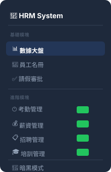
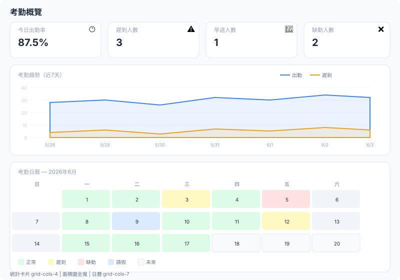
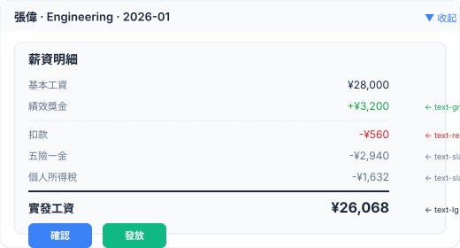
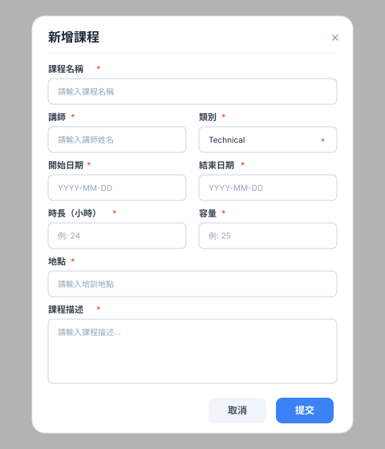

# 🎨 HRM 進階模塊 UI 設計說明文檔

> 本文檔為 4.2 四個新模塊提供 SVG 布局圖引用和精確的 Tailwind 類名規範。
> 設計系統（色彩、間距、圓角、陰影）延續 4.1 基礎模塊的 UI 設計說明。

---

## 一、全局導航擴展

4.1 的 Sidebar 新增 4 個導航項：



> 移動端：頂部 Tab 按鈕增加 4 個，使用 `overflow-x-auto` 水平滾動。

---

## 二、考勤管理模塊

### 2.1 考勤概覽頁



**組件結構**：

```
AttendanceOverview
├── 統計卡片組 (grid-cols-2 md:grid-cols-4)
│   ├── MetricCard: 今日出勤率
│   ├── MetricCard: 遲到人數
│   ├── MetricCard: 早退人數
│   └── MetricCard: 缺勤人數
├── 考勤趨勢圖 (Recharts AreaChart, 全寬)
│   └── ResponsiveContainer height={300}
└── 考勤日曆視圖 (CSS Grid 7列)
    ├── 週頭: 日 一 二 三 四 五 六
    └── 日期格子: 根據狀態著色
```

**日曆格子樣式**：

| 狀態 | 亮色 | 暗色 |
|---|---|---|
| Normal | `bg-green-100 text-green-800` | `dark:bg-green-900/30 dark:text-green-400` |
| Late | `bg-yellow-100 text-yellow-800` | `dark:bg-yellow-900/30 dark:text-yellow-400` |
| Early Leave | `bg-orange-100 text-orange-800` | `dark:bg-orange-900/30 dark:text-orange-400` |
| Absent | `bg-red-100 text-red-800` | `dark:bg-red-900/30 dark:text-red-400` |
| On Leave | `bg-blue-100 text-blue-800` | `dark:bg-blue-900/30 dark:text-blue-400` |
| 未來 | `bg-slate-50 text-slate-400` | `dark:bg-zinc-800 dark:text-zinc-500` |
| 週末 | `bg-slate-100 text-slate-400` | `dark:bg-zinc-800/50 dark:text-zinc-500` |

### 2.2 考勤記錄表


**工具欄**：`flex flex-col md:flex-row gap-4 mb-6`

| 組件 | 寬度 | Tailwind |
|---|---|---|
| 日期選擇器 | `w-full md:w-48` | `Input type="date"` |
| 部門篩選 | `w-full md:w-40` | `Select` |
| 狀態篩選 | `w-full md:w-40` | `Select` |
| 模擬打卡 | `ml-auto` | `Button variant="outline"` |

**表格**：同 4.1 員工表格樣式，額外列的對齊：

| 列 | 對齊 | 寬度 |
|---|---|---|
| 員工 | 左 | `w-[200px]` |
| 日期 | 左 | `w-[120px]` |
| 上班打卡 | 居中 | `w-[100px]` |
| 下班打卡 | 居中 | `w-[100px]` |
| 狀態 | 居中 | `w-[100px]` |
| 工時 | 右 | `w-[80px]` |

---

## 三、薪資管理模塊

### 3.1 薪資概覽頁


**組件結構**：

```
PayrollOverview
├── 統計卡片組 (grid-cols-2 md:grid-cols-4)
│   ├── MetricCard: 本月薪資總額
│   ├── MetricCard: 平均薪資
│   ├── MetricCard: 最高薪資
│   └── MetricCard: 待確認薪資單
└── 圖表區 (grid-cols-1 lg:grid-cols-2 gap-6)
    ├── SalaryBarChart: 部門薪資對比
    └── SalaryPieChart: 薪資構成佔比
```

**薪資構成餅圖顏色**：

| 項目 | 顏色 | 色值 |
|---|---|---|
| 基本工資 | 藍色 | `#3b82f6` |
| 獎金 | 綠色 | `#10b981` |
| 扣款 | 紅色 | `#ef4444` |
| 五險一金 | 紫色 | `#8b5cf6` |
| 個稅 | 橙色 | `#f59e0b` |

### 3.2 薪資明細表


**展開詳情面板**：



**展開動畫**：使用 `grid grid-rows-[0fr]` → `grid-rows-[1fr]` + `transition-all` 實現平滑展開。

> **Flutter 對應**：`ExpansionTile` + `AnimatedCrossFade`

**批量操作欄**（表格上方，選中時出現）：


---

## 四、招聘管理模塊

### 4.1 招聘看板


**三欄看板**：同 4.1 請假看板的 `DragDropContext` + `Droppable` + `Draggable` 模式。

**列頭設計**：

| 列 | 圓點顏色 | 計數 | 背景 |
|---|---|---|---|
| 開放中 | `bg-green-500` | 綠色 Badge | `bg-green-50/50 dark:bg-green-950/20` |
| 暫停 | `bg-yellow-500` | 黃色 Badge | `bg-yellow-50/50 dark:bg-yellow-950/20` |
| 已關閉 | `bg-slate-400` | 灰色 Badge | `bg-slate-50/50 dark:bg-slate-900/20` |

**職位卡片**：


### 4.2 新增/編輯職位彈窗


**彈窗尺寸**：`max-w-lg`

**表單佈局**：

| 行 | 字段 | 佈局 |
|---|---|---|
| 1 | 職位名稱 | 全寬 |
| 2 | 部門 + 職位類型 | `grid grid-cols-2 gap-4` |
| 3 | 工作地點 | 全寬 |
| 4 | 薪資範圍（最低 + 最高） | `grid grid-cols-2 gap-4` |
| 5 | 職位描述 | 全寬 Textarea |
| 6 | 任職要求 | 全寬 Textarea |

---

## 五、培訓管理模塊

### 5.1 培訓課程列表


**佈局**：`grid grid-cols-1 md:grid-cols-2 lg:grid-cols-3 gap-6`

**課程卡片**：


**進度條樣式**：

```tsx
// 外軌
<div className="w-full bg-slate-100 dark:bg-zinc-700 rounded-full h-2">
  // 內軌
  <div
    className="bg-blue-500 h-2 rounded-full transition-all duration-300"
    style={{ width: `${percentage}%` }}
  />
</div>
```

**進度條顏色映射**：

| 百分比 | 顏色 | Tailwind |
|---|---|---|
| < 60% | 藍色 | `bg-blue-500` |
| 60-80% | 橙色 | `bg-orange-500` |
| > 80% | 紅色 | `bg-red-500` |
| 100% | 灰色 | `bg-slate-400` + 按鈕顯示「已滿」 |

### 5.2 新增/編輯課程彈窗



**彈窗尺寸**：`max-w-lg`

**表單佈局**：

| 行 | 字段 | 佈局 |
|---|---|---|
| 1 | 課程名稱 | 全寬 |
| 2 | 講師 + 類別 | `grid grid-cols-2 gap-4` |
| 3 | 開始日期 + 結束日期 | `grid grid-cols-2 gap-4` |
| 4 | 時長 + 容量 | `grid grid-cols-2 gap-4` |
| 5 | 地點 | 全寬 |
| 6 | 課程描述 | 全寬 Textarea |

---

## 六、響應式斷點規範

| 斷點 | 寬度 | 布局變化 |
|---|---|---|
| 移動端 | < 768px | 單列佈局，Sidebar 隱藏，Tab 水平滾動 |
| 平板端 | 768-1023px | 雙列卡片，看板單列堆疊 |
| 桌面端 | ≥ 1024px | 四列卡片，看板三列，Sidebar 固定 |

**各模塊響應式差異**：

| 模塊 | 移動端 | 平板端 | 桌面端 |
|---|---|---|---|
| 考勤統計卡片 | 2列 | 2列 | 4列 |
| 考勤日曆 | 隱藏（僅表格） | 顯示 | 顯示 |
| 薪資圖表 | 單列堆疊 | 單列 | 雙列 |
| 招聘看板 | 單列堆疊 | 單列 | 三列 |
| 培訓卡片 | 1列 | 2列 | 3列 |
