# 🎨 HRM 高級模塊 UI 設計說明文檔

> 本文檔為 4.3 四個新模塊提供 SVG 布局圖和精確的 Tailwind 類名規範。
> 設計系統延續 4.1 + 4.2 的 UI 設計說明。

---

## 一、全局導航擴展

4.2 的 Sidebar 新增 4 個導航項：


---

## 二、績效管理模塊

### 2.1 績效總覽頁

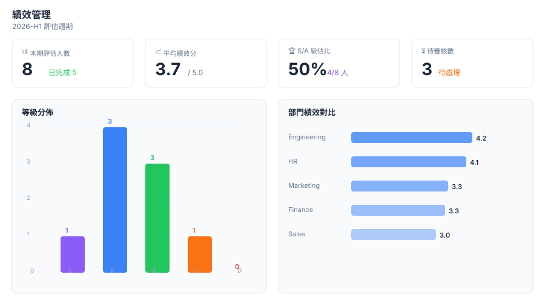

**組件結構**：

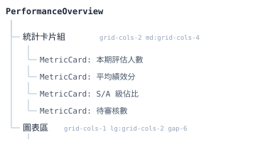

**等級 Badge 樣式**：

| 等級 | 亮色 | 暗色 |
|---|---|---|
| S | `bg-purple-100 text-purple-800 text-lg font-bold` | `dark:bg-purple-900/30 dark:text-purple-400` |
| A | `bg-blue-100 text-blue-800 text-lg font-bold` | `dark:bg-blue-900/30 dark:text-blue-400` |
| B | `bg-green-100 text-green-800 text-lg font-bold` | `dark:bg-green-900/30 dark:text-green-400` |
| C | `bg-orange-100 text-orange-800 text-lg font-bold` | `dark:bg-orange-900/30 dark:text-orange-400` |
| D | `bg-red-100 text-red-800 text-lg font-bold` | `dark:bg-red-900/30 dark:text-red-400` |

### 2.2 績效評估列表

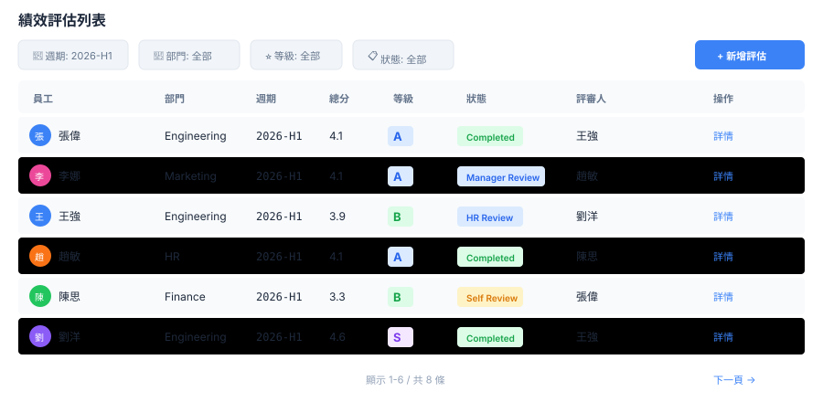

**篩選工具欄**：`flex flex-col md:flex-row gap-4 mb-6`

| 組件 | 寬度 | Tailwind |
|---|---|---|
| 週期選擇 | `w-full md:w-40` | `Select` |
| 部門篩選 | `w-full md:w-40` | `Select` |
| 等級篩選 | `w-full md:w-32` | `Select` |
| 狀態篩選 | `w-full md:w-40` | `Select` |
| 新增評估 | `ml-auto` | `Button` |

### 2.3 績效詳情頁

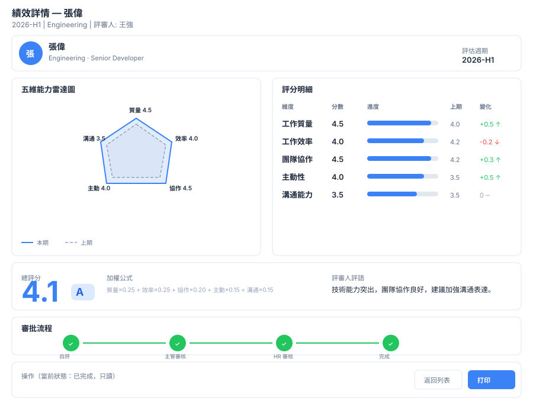

**五維雷達圖**（Recharts RadarChart）：

```tsx
<RadarChart cx={200} cy={200} outerRadius={150} width={400} height={400}>
  <PolarGrid />
  <PolarAngleAxis dataKey="dimension" />
  <Radar name="本期" dataKey="current" stroke="#3b82f6" fill="#3b82f6" fillOpacity={0.3} />
  <Radar name="上期" dataKey="previous" stroke="#94a3b8" fill="#94a3b8" fillOpacity={0.1} strokeDasharray="5 5" />
  <Legend />
</RadarChart>
```

**評分明細表**：

| 維度 | 分數 | 進度條 | 上期 | 變化 |
|---|---|---|---|---|
| 工作質量 | 4.2 | `bg-blue-500` 進度條 | 3.8 | `text-green-600` ↑ |
| 工作效率 | 3.8 | `bg-blue-500` 進度條 | 4.0 | `text-red-600` ↓ |
| 團隊協作 | 4.5 | `bg-blue-500` 進度條 | 4.2 | `text-green-600` ↑ |
| 主動性 | 4.0 | `bg-blue-500` 進度條 | 3.5 | `text-green-600` ↑ |
| 溝通能力 | 3.6 | `bg-blue-500` 進度條 | 3.6 | `text-slate-400` ─ |

**審批流程進度條**：


- 已完成：`bg-green-500 text-white`
- 進行中：`bg-blue-500 text-white` + 脈動動畫 `animate-pulse`
- 未開始：`bg-slate-200 text-slate-400 dark:bg-zinc-700`

### 2.4 新增績效評估彈窗

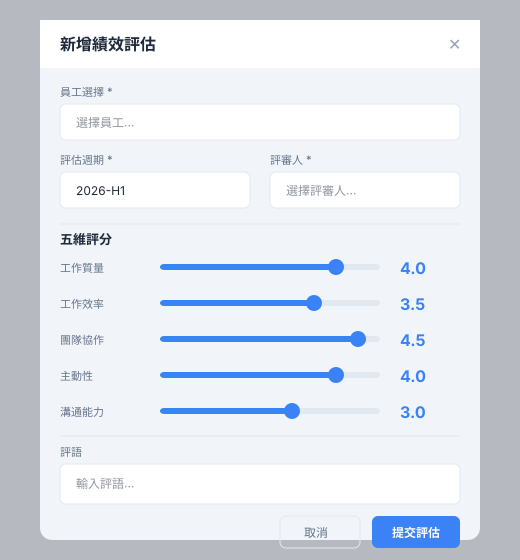

**彈窗尺寸**：`max-w-xl`

**Slider 評分控件**：

```tsx
<div className="flex items-center gap-4">
  <label className="w-24 text-sm font-medium text-slate-700 dark:text-slate-300">
    {label}
  </label>
  <input
    type="range" min="1" max="5" step="0.5"
    value={value}
    onChange={(e) => onChange(Number(e.target.value))}
    className="flex-1 h-2 bg-slate-200 rounded-lg appearance-none cursor-pointer accent-blue-500"
  />
  <span className="w-10 text-center font-mono text-lg font-bold text-blue-600">
    {value.toFixed(1)}
  </span>
</div>
```

---

## 三、報表中心模塊

### 3.1 報表總覽頁

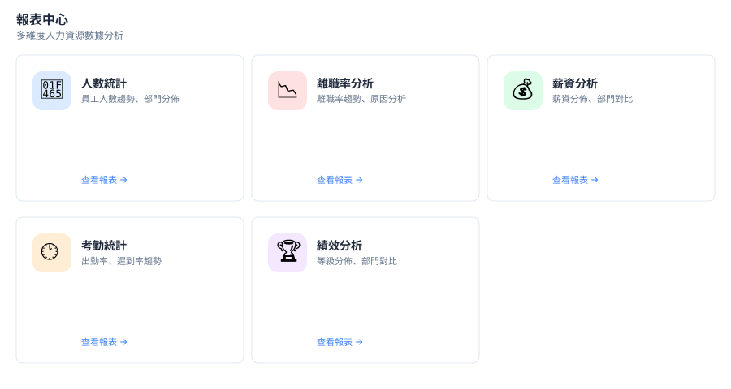

**報表類型卡片**：`grid grid-cols-1 md:grid-cols-2 lg:grid-cols-3 gap-6`

每張卡片：


### 3.2 人數統計報表

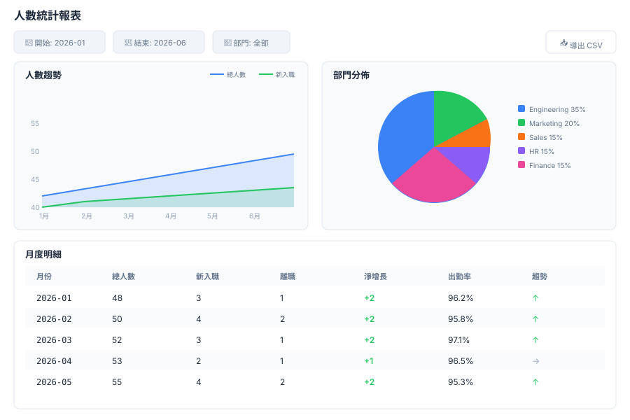

**篩選區**：`flex flex-col md:flex-row gap-4 mb-6`

| 組件 | 寬度 |
|---|---|
| 開始日期 | `w-full md:w-40` |
| 結束日期 | `w-full md:w-40` |
| 部門 | `w-full md:w-40` |
| 導出按鈕 | `ml-auto` |

**圖表區**（`grid-cols-1 lg:grid-cols-2 gap-6`）：

1. 人數趨勢面積圖（AreaChart，三條線堆疊）
2. 部門分佈餅圖（PieChart）

### 3.3 薪資分析報表

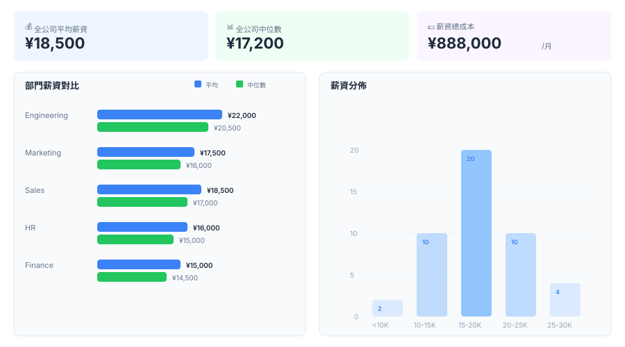

**匯總卡片**：`grid grid-cols-3 gap-4`

| 指標 | 樣式 |
|---|---|
| 全公司平均薪資 | `bg-blue-50 dark:bg-blue-950/30` |
| 全公司中位數 | `bg-green-50 dark:bg-green-950/30` |
| 薪資總成本 | `bg-purple-50 dark:bg-purple-950/30` |

---

## 四、通知中心模塊

### 4.1 通知列表頁

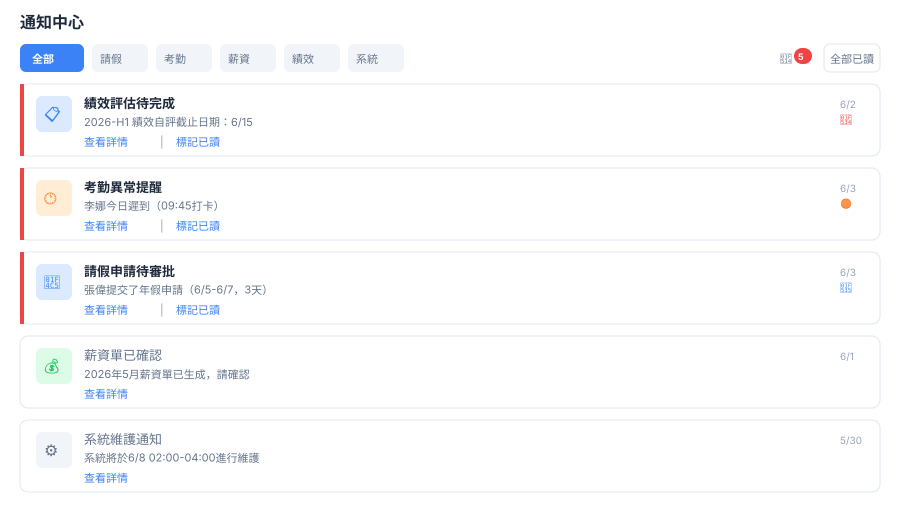

**頂部操作欄**：


**通知卡片**：


- 未讀：`border-l-4 border-red-500 bg-white dark:bg-zinc-800`
- 已讀：`border-l-4 border-transparent bg-slate-50 dark:bg-zinc-800/50`

**優先級圖標**：

| 優先級 | 圖標 | 顏色 |
|---|---|---|
| urgent | `AlertCircle` | `text-red-500 animate-pulse` |
| high | `AlertTriangle` | `text-orange-500` |
| normal | `Info` | `text-blue-500` |
| low | `Minus` | `text-slate-400` |

**通知類型圖標顏色**：

| 類型 | 圖標 | 圖標背景 |
|---|---|---|
| leave | `CalendarOff` | `bg-blue-100 text-blue-600` |
| attendance | `Clock` | `bg-orange-100 text-orange-600` |
| payroll | `DollarSign` | `bg-green-100 text-green-600` |
| performance | `Award` | `bg-purple-100 text-purple-600` |
| system | `Settings` | `bg-slate-100 text-slate-600` |

### 4.2 通知設置頁

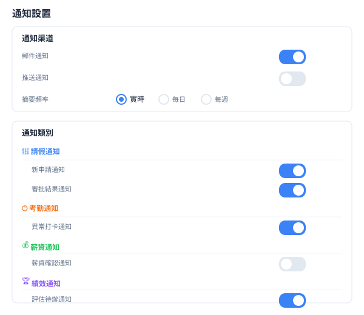

**設置項佈局**：


**Switch 組件樣式**：

```tsx
<label className="flex items-center justify-between py-3">
  <span className="text-sm text-slate-700 dark:text-slate-300">{label}</span>
  <button
    role="switch"
    aria-checked={enabled}
    onClick={() => onChange(!enabled)}
    className={cn(
      'relative inline-flex h-6 w-11 items-center rounded-full transition-colors',
      enabled ? 'bg-blue-500' : 'bg-slate-200 dark:bg-zinc-600'
    )}
  >
    <span className={cn(
      'inline-block h-4 w-4 rounded-full bg-white transition-transform',
      enabled ? 'translate-x-6' : 'translate-x-1'
    )} />
  </button>
</label>
```

---

## 五、系統設置模塊

### 5.1 設置首頁

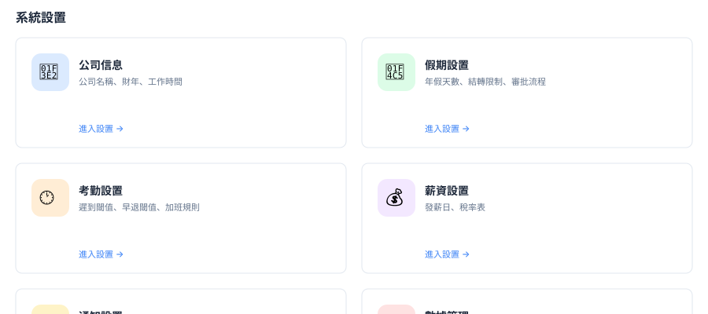

**設置分區卡片**：`grid grid-cols-1 md:grid-cols-2 gap-6`

每張卡片：


### 5.2 公司信息設置


**表單佈局**：

| 行 | 字段 | 佈局 |
|---|---|---|
| 1 | 公司名稱 | 全寬 |
| 2 | Logo URL | 全寬 |
| 3 | 財年起始 | `w-48` |
| 4 | 上班時間 + 下班時間 | `grid grid-cols-2 gap-4` |
| 5 | 工作日 | Checkbox Group（7 個複選框） |

**工作日 Checkbox Group**：

```tsx
<div className="flex flex-wrap gap-3">
  {['週一','週二','週三','週四','週五','週六','週日'].map((day, i) => (
    <label key={i} className="flex items-center gap-2">
      <input type="checkbox" checked={workingDays.includes(i+1)}
        onChange={() => toggleDay(i+1)}
        className="rounded border-slate-300 text-blue-500 focus:ring-blue-500" />
      <span className="text-sm">{day}</span>
    </label>
  ))}
</div>
```

### 5.3 假期設置

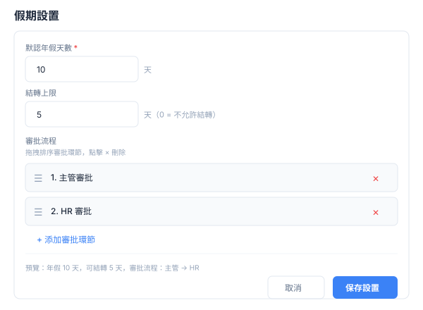

**審批流程拖拽排序**：


- 拖拽手柄：`cursor-grab active:cursor-grabbing`
- 刪除按鈕：`text-red-400 hover:text-red-600`

### 5.4 薪資設置

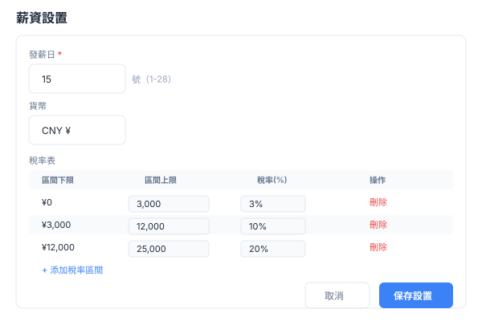

**稅率表可編輯表格**：

| 列 | 控件 | 寬度 |
|---|---|---|
| 區間下限 | Input(number) | `w-32` |
| 區間上限 | Input(number) | `w-32` |
| 稅率(%) | Input(number) | `w-24` |
| 操作 | 刪除按鈕 | `w-16` |

底部添加按鈕：`text-blue-600 hover:text-blue-800`

### 5.5 數據管理

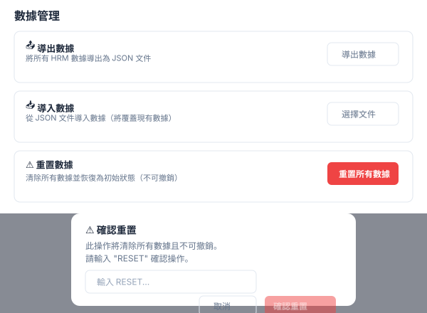

**操作卡片**：


**二次確認彈窗**：

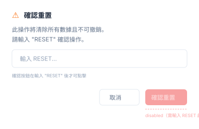

---

## 六、響應式斷點規範

| 斷點 | 寬度 | 布局變化 |
|---|---|---|
| 移動端 | < 768px | 單列佈局，Sidebar 隱藏 |
| 平板端 | 768-1023px | 雙列卡片，圖表單列 |
| 桌面端 | ≥ 1024px | 三列卡片，圖表雙列，Sidebar 固定 |

**各模塊響應式差異**：

| 模塊 | 移動端 | 平板端 | 桌面端 |
|---|---|---|---|
| 績效統計卡片 | 2列 | 2列 | 4列 |
| 績效圖表 | 單列 | 單列 | 雙列 |
| 報表卡片 | 1列 | 2列 | 3列 |
| 報表圖表 | 單列 | 單列 | 雙列 |
| 通知列表 | 全寬 | 全寬 | 全寬 |
| 通知設置 | 全寬 | 全寬 | max-w-2xl |
| 設置卡片 | 1列 | 2列 | 2列 |
| 設置表單 | 全寬 | 全寬 | max-w-2xl |
